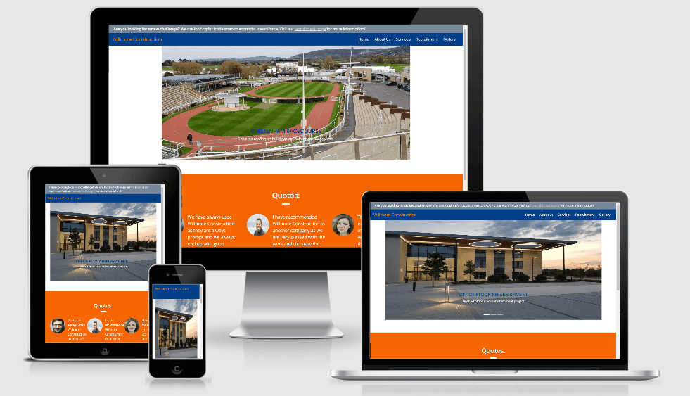
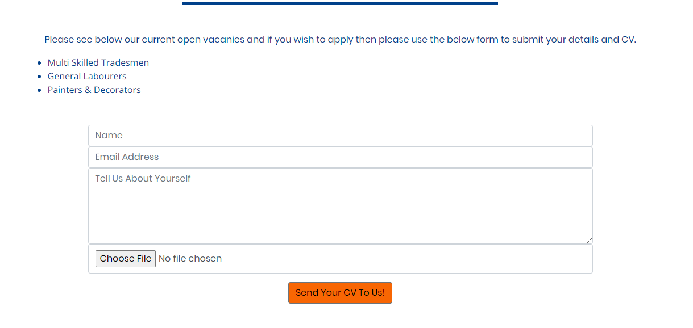

# Willmore Construction

Project One : User-Centric Frontend Development - Code Institute

Willmore Construction has been made for a company that require an update on their current website. 

It allows customers to see what type of company they are, it allows potential employees to see if they are recruiting and it allows people to see examples of their work.

## Demo
A live demo can be found [here](https://drogrinhunter.github.io/milestoneproject1/index.html).

## UX
 
 As a potential employee of the company, I expect to see a varient of potential roles and the ability to apply for a role with the capability of attaching a CV.

 

 As a business, I expect to be able to see what the company is about and their location should I wish to give them my business.

 
 

## Features

The website uses many different features: 
* Index - the "Home" page features a Carousel that allows the user to click through three different images with captions. This is a brief view of what the company does.
* About Us - the "About Us" page features a Google Maps API which is fully customizable to the users location. It allows them to find nearby locations that they might know to use for comparison.
* Recruitment - the "Recruitment" page allows potential employees to search for any roles that are available and to contact the business and send their CV in for consideration.
* Gallery - the "Gallery" page allows users to see examples of previous work done by the company. They can click on a picture as a single image whilst also allowing them to see all pictures at once.
 
### Features Left to Implement
In the future, I would like to add different animations to the "Gallery" page allowing for different user experiences. 

### Strategy
My goal in the design was to make it easy for people to access information whilst aiming for a minimalistic and user-friendly design.

### Scope
For customers, I wanted to provide them with a easy way to see what the company was about as well as see examples of their work which was the reason for the carousel on the index page.
For potential employees, I wanted to be able to provide them with an easy way to see whether they had any roles available hence the alert bar on the Index page.

### Structure 
In the "Services" page, I wanted customers to be able to see quickly what type of solutions the company can assist with.

### Skeleton
[Initial Wireframe](assets/images/readme-images/initial-mockup.pdf "Initial Mockup"){:target="_blank"}

### Surface
The blue / orange colour scheme was chosen to allow to differentiate between title and content easily. 

## Technologies Used

In this section, you should mention all of the languages, frameworks, libraries, and any other tools that you have used to construct this project. For each, provide its name, a link to its official site and a short sentence of why it was used.

- [JQuery](https://jquery.com)
    - The project uses **JQuery** to simplify DOM manipulation.
- [HTML5](https://developer.mozilla.org/en-US/docs/Web/HTML)
    - The project uses **HTML 5** for it's main content.
- [CSS](https://developer.mozilla.org/en-US/docs/Web/CSS/Reference)
    - The project uses **CSS** for it's design and styling.
- [Bootstrap](https://getbootstrap.com/)
    - The project uses **Bootstrap** for it's responsiveness for mobile design. 

## Testing

The customer and potential employee user story achieved the intended outcome by providing them with a showcase of both examples of the company as well as potential roles.
In the "Home" page, customers are able to see a few examples of work that the company have done, this is done by the Bootstrap Carousel with captions about the images. They are also able see quotes provided by other companies which provides a positive experience for the customer as it means that they don't have to search around the website for this information.
In the "About Us" page, both customers and candidates can read the story of how the company came to fruition and what they are about. It also allows them to find out where the company is located and near by surroundings.
In the "Services" page, it has a brief overview of what services the company provides, this is done via clicking the link in the navigation bar which provides another positive experience for users. They can also go straight to examples of the work, this is done by the link provided.
In the "Recruitment" page, it allows candidates to easily see whether the company has any roles that they can apply for. It allows for a positive experience as they are able to use a contact form to contact the business with their details but they are also able to submit their CV without needing to submit a long form with previous experiences making the time applying for a job shorter. Candidates will then get a confirmation popup from the browser advising that the submission form has gone through which allows for a positive experience as they will not need to stress about whether the form has submitted or not.
In the "Gallery" page, both customers and candidates can easily see a collection of images which shows what services have been completed previously. The positive experience comes from the user being able to click on a single image which will enlarge and allow the user to search and examine the images; it will also allow them to go through the images using the arrow keys on their keyboards.

For any scenarios that have not been automated, test the user stories manually and provide as much detail as is relevant. A particularly useful form for describing your testing process is via scenarios, such as:

1. Contact form:
    1. Go to the "Contact Us" page
    2. Try to submit the empty form and verify that an error message about the required fields appears
    3. Try to submit the form with an invalid email address and verify that a relevant error message appears
    4. Try to submit the form with all inputs valid and verify that a success message appears.

In addition, you should mention in this section how your project looks and works on different browsers and screen sizes.

You should also mention in this section any interesting bugs or problems you discovered during your testing, even if you haven't addressed them yet.

If this section grows too long, you may want to split it off into a separate file and link to it from here.

## Deployment

This section should describe the process you went through to deploy the project to a hosting platform (e.g. GitHub Pages or Heroku).

In particular, you should provide all details of the differences between the deployed version and the development version, if any, including:
- Different values for environment variables (Heroku Config Vars)?
- Different configuration files?
- Separate git branch?

In addition, if it is not obvious, you should also describe how to run your code locally.

## Credits

### Content
- The text for section Y was copied from the [Wikipedia article Z](https://en.wikipedia.org/wiki/Z)

### Media
- The photos used in this site were obtained from ...

### Acknowledgements

- I received inspiration for this project from X
